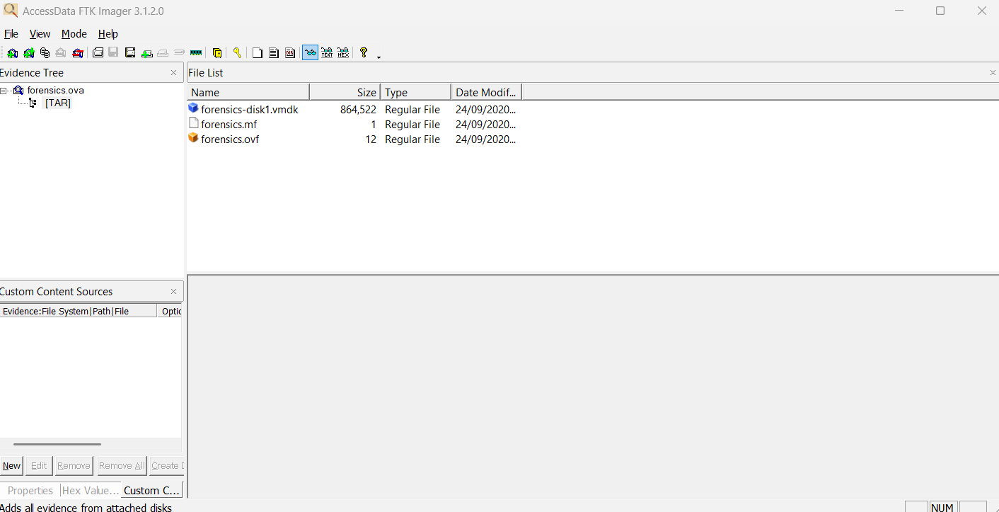
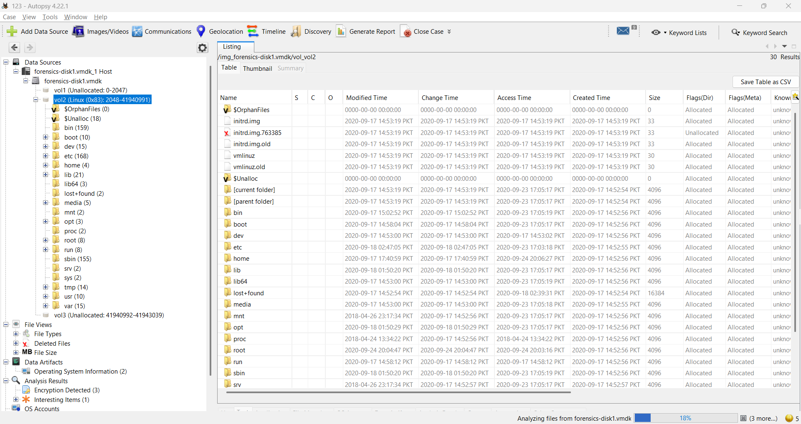
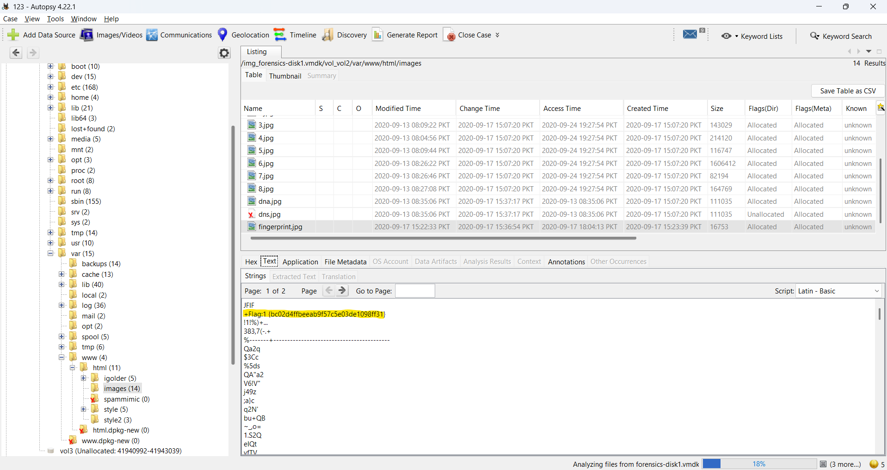
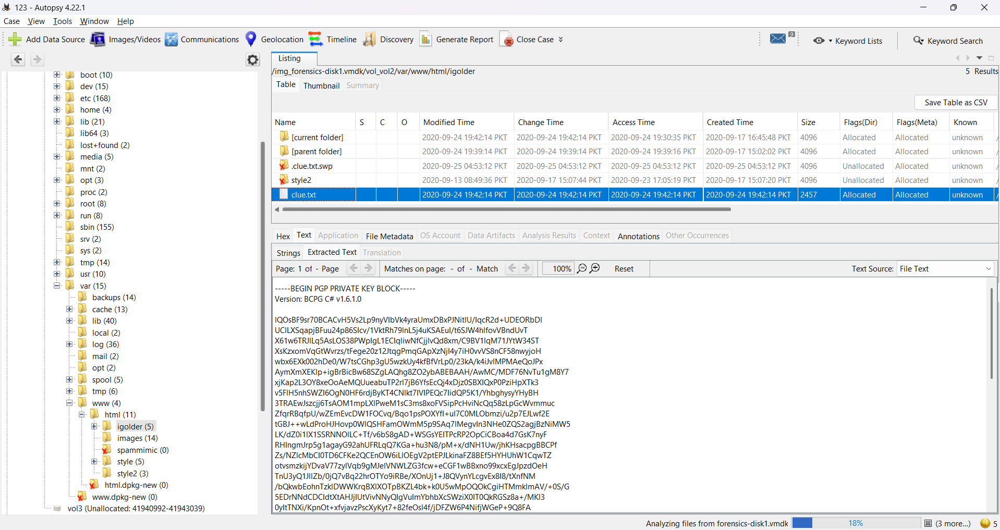
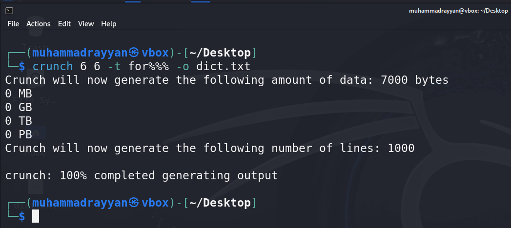
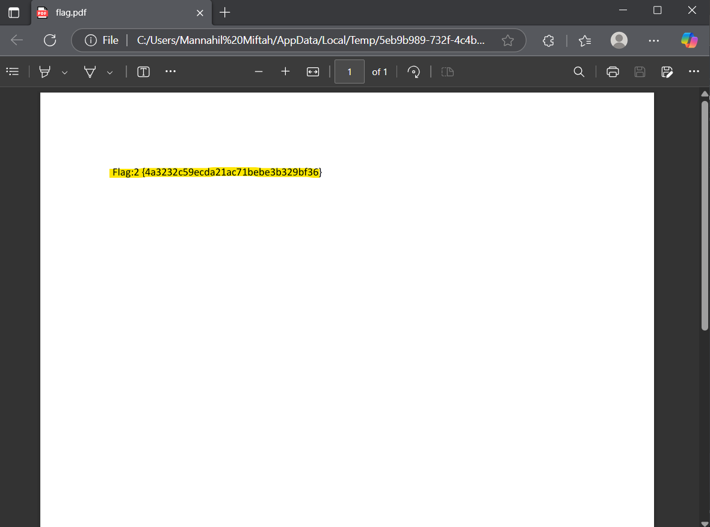
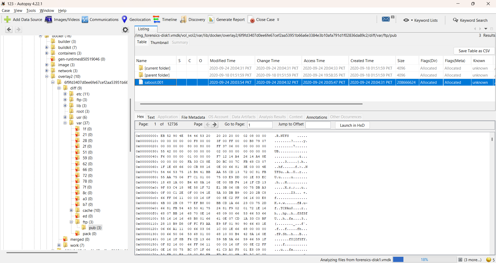
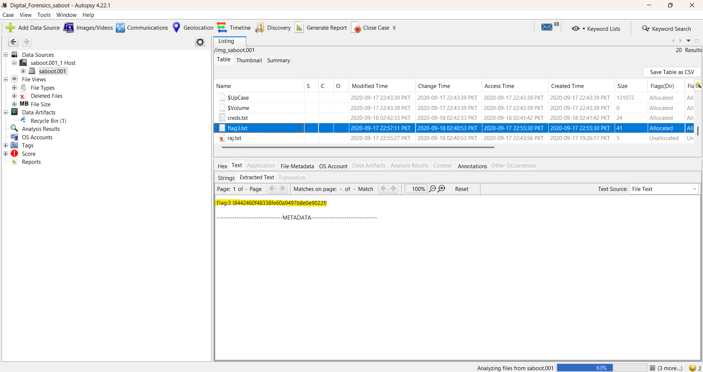
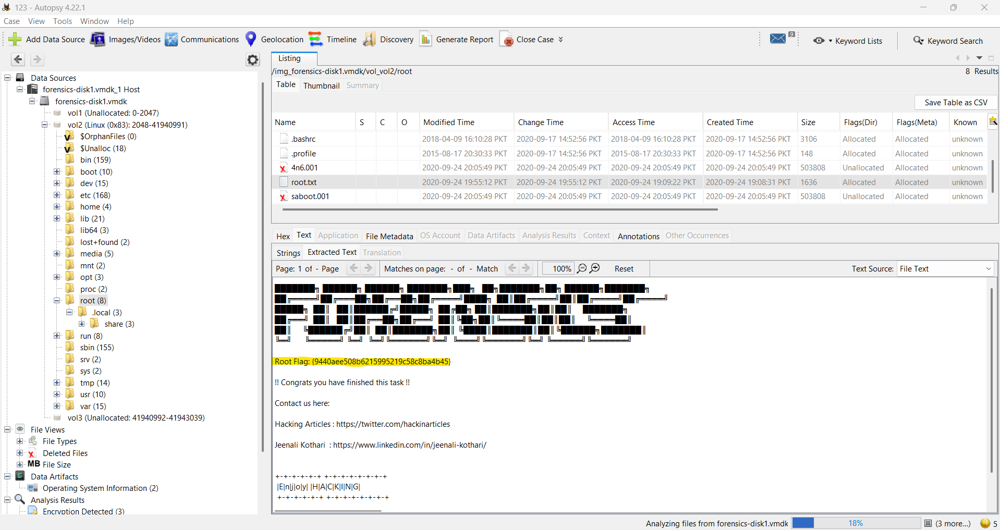

# HA: FORENSICS - VulnHub WALKTHROUGH

---

## TABLE OF CONTENTS
- [Overview](#overview)
- [Tools Used](#tools-used)
- [Step 1: Extracting the OVA Contents](#step-1-extracting-the-ova-contents)
- [Step 2: Analyzing the Disk with Autopsy](#step-2-analyzing-the-disk-with-autopsy)
- [Step 3: Finding Flag 1](#step-3-finding-flag-1)
- [Step 4: Discovering the Clues for Flag 2](#step-4-discovering-the-clues-for-flag-2)
- [Step 5: Cracking the Password & Finding Flag 2](#step-5-cracking-the-password-&-finding-flag-2)
- [Step 6: Finding Flag 3](#step-6-finding-flag-3)
- [Step 7: Finding Flag 4](#step-7-finding-flag-4)
- [Conclusion](#conclusion)

---

## OVERVIEW
This is a forensic analysis lab from VulnHub named HA: Forensics, where the goal is to:

- Extract data from a given OVA file
- Investigate its contents using forensics tools
- Locate and capture 4 flags

---

## TOOLS USED
| Tool                     | Purpose                                          |
| ------------------------ | ------------------------------------------------ |
| **FTK Imager**           | To mount and extract the OVA contents            |
| **Autopsy**              | To analyze the Linux file system in the VM disk  |
| **crunch**               | To generate a wordlist for brute-forcing the ZIP |
| **fcrackzip**            | To brute-force the password-protected ZIP file   |
| **PGP decryption tools** | To decrypt the clue message (online used)        |
| **Kali Linux terminal**  | For password cracking and analysis               |

---

## STEP 1: EXTRACTING THE OVA CONTENTS
FTK Imager was used to load and extract the contents of the OVA file:
- Open FTK Imager → `File` > `Add Evidence Item` → choose the `OVA File`.
- Select the `file items` > `Right Click` → `Export Files`.
- This gave us:
  - A `.vmdk` file (virtual disk)
  - A `.ovf` descriptor
  - A `.mf` manifest file



---

## STEP 2: ANALYZING THE DISK WITH AUTOPSY
- Loaded the `.vmdk` into Autopsy for the filesystem analysis.

Autopsy steps:
- `Create New Case`
- Add data source → choose the `.vmdk` disk.
- Let Autopsy parse the filesystem.



---

## STEP 3: FINDING FLAG 1
- Navigated to `/var/www/html/images` directory inside Autopsy.
- Found an interesting file: `fingerprint.jpg`.

In Autopsy, inspecting the metadata/text embedded in the image showed a hidden flag under the text section.


```
Flag 1: {bc02d4ffbeeab9f57c5e03de1098ff31}
```

---

## STEP 4: DISCOVERING THE CLUES FOR FLAG 2
- In `/var/www/html`, found a file named `tips.txt` which contained:
<pre>/flag.zip
/igolder</pre>
- Navigated to `/var/www/html/igolder`, found a file named `clue.txt`.
- `clue.txt` contained:
  - A PGP private key
  - A PGP-encrypted message



Used an online PGP decryption tool, the decrypted message said:
> In case the forensic investigator forgets his password, this hint can help him, where the password is of 6 characters long.
> Starting 3 characters is the word "for" and the ending 3 characters are numeric.

---

## STEP 5: CRACKING THE PASSWORD & FINDING FLAG 2
- In `/var/www/html`, found flag.zip.
Generated a targeted wordlist using `crunch`:
```bash
crunch 6 6 -t for%%% -o dict.txt
```



Brute-forced with fcrackzip:
```bash
fcrackzip -u -D -p dict.txt flag.zip
```
- Successfully cracked the password: `for007`.
- Extracted the zip file and found a PDF. Opened it to get Flag 2.


```
Flag 2: {4a3232c59ecda21ac71bebe3b329bf36}
```

---

## STEP 6: FINDING FLAG 3
- Explored deeper into the filesystem, found under Docker overlay:
<pre>/var/lib/docker/overlay2/6f9fd3407d0ee6fe67cef2aa53951b66a6e3384e3b10afa791d1f02836da89c2/diff/var/ftp/pub/saboot.001</pre>



- Extracted `saboot.001` from Autopsy.
- Added it as a new data source in Autopsy. There, found `flag3.txt` which contained Flag 3.


```
Flag 3: {8442460f48338fe60a9497b8e0e9022f}
```

---

## STEP 7: FINDING FLAG 4
- Finally, in the root directory `/` found a file named `root.txt`.
- Opened it to reveal Flag 4.


```
Flag 4: {9440aee508b6215995219c58c8ba4b45}
```

---

## CONCLUSION
Summary of the flags found:
| Flag       | Location                                                                      |
| ---------- | ----------------------------------------------------------------------------- |
| **Flag 1** | Hidden text in `fingerprint.jpg` under `/var/www/html/images`                 |
| **Flag 2** | Inside password-protected `flag.zip` (password `for007`) from `/var/www/html` |
| **Flag 3** | In `flag3.txt` inside `saboot.001` from Docker overlay FTP pub                |
| **Flag 4** | In `root.txt` in the root directory `/`                                       |

---

This completes the forensics analysis on HA: Forensics from VulnHub.
